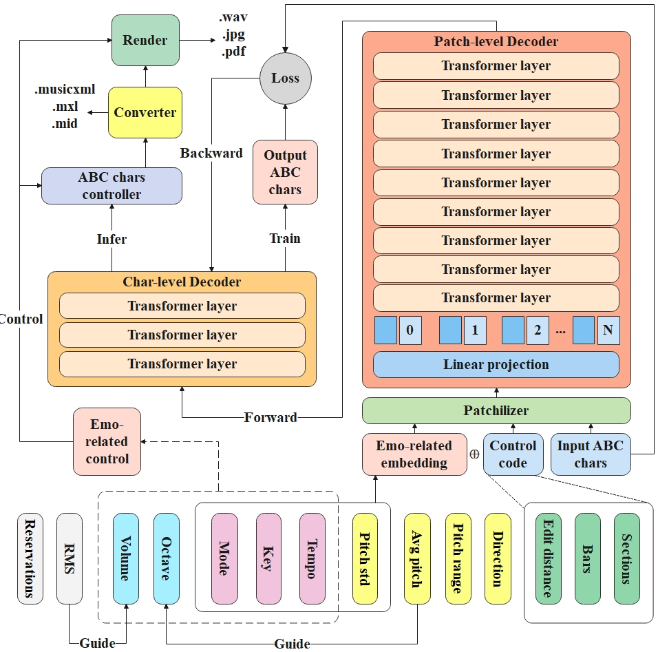
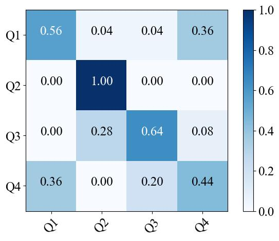
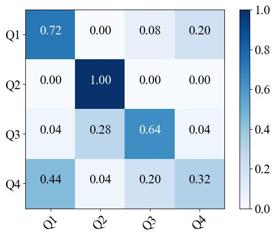
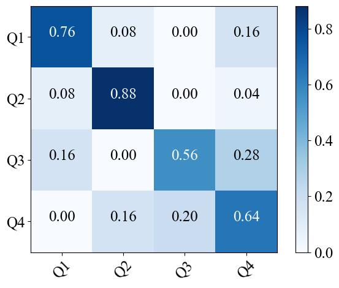
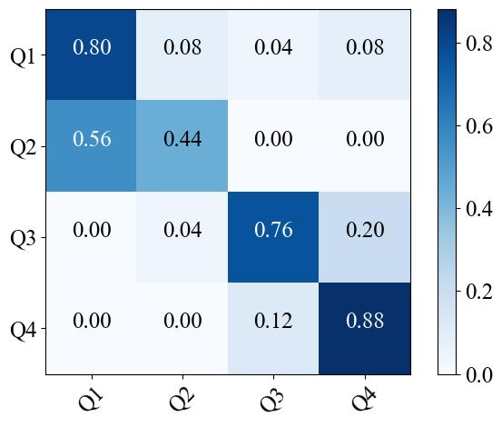
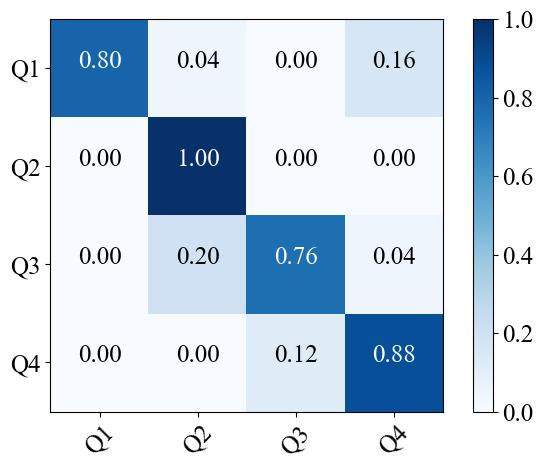
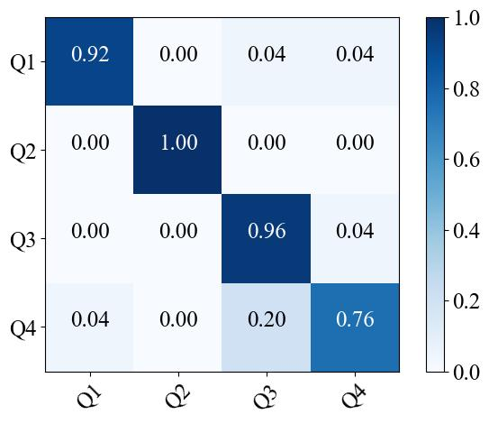
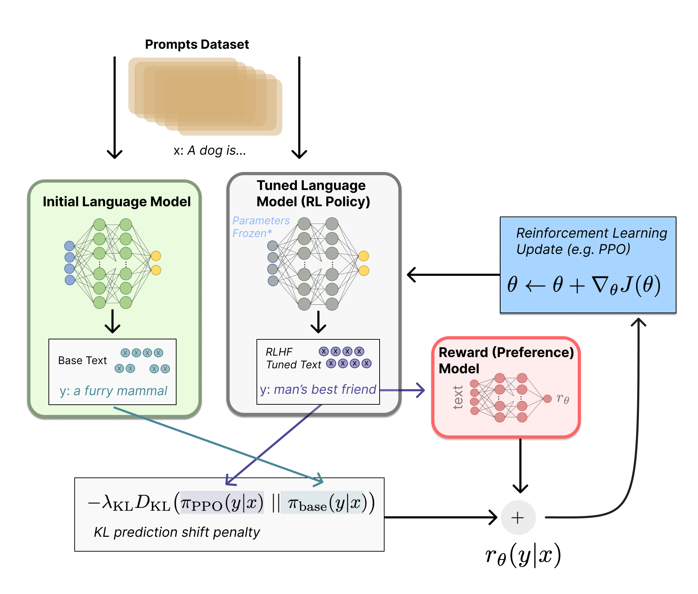

# EMusicGen
[](https://github.com/monetjoe/EMusicGen/blob/master/LICENSE)
[](https://github.com/monetjoe/EMusicGen/actions/workflows/python-app.yml)
[](https://www.modelscope.cn/datasets/monetjoe/EMusicGen)
[](https://www.modelscope.cn/models/monetjoe/EMusicGen)
[](https://www.modelscope.cn/studios/monetjoe/EMusicGen)
[](https://huggingface.co/datasets/monetjoe/EMusicGen)
[](https://huggingface.co/monetjoe/EMusicGen)
[](https://huggingface.co/spaces/monetjoe/EMusicGen)

Emotionally Conditioned Melody Generation in ABC Notation



Our work represents the first exploratory attempt to generate emotion-conditioned melodies using ABC notation. Previous research on emotion-conditioned melody generation based on symbolic music has predominantly focused on MIDI or other label systems, so we have no direct comparisons, datasets, or methods to rely on. Our goal is to generate emotionally controlled melodies with relatively consistent scores, which is a highly challenging task.

Given the lack of ABC notation datasets with emotion labels, we turned to existing MIDI datasets with emotion annotations, namely EMOPIA and VGMIDI. We wrote scripts to convert them into ABC notation format and clean the data. However, training the Tuneformer model with these datasets was challenging, as it struggled to produce well-formed scores, resulting in a low error-free rate (the error-free rate is calculated based on the music21 library, which determines whether the generated score can be parsed correctly without errors). These datasets, although labeled, were not suitable for training.

On the other hand, training Tuneformer with datasets containing well-formed scores (such as JSB, Nottingham, Wikifonia, Essen, and Irishman, ...) produced high error-free rates, but these datasets lacked emotion labels, making them suitable for training but without annotations. As a result, we conducted statistical correlation experiments on the merged VGMIDI and EMOPIA datasets, identifying features strongly correlated with emotions. These experimental findings were then used as prior knowledge to guide the automatic rough labeling of the well-formed score dataset, creating the Rough4Q dataset. To mitigate the impact of label transfer across datasets, we involved prior knowledge from music psychology to select mode and pitch standard deviation (pitchSD) as criteria for roughly labeling the 4Q emotions. These features were then used as control variables in the embedding stage.

However, these two features alone were insufficient to fully control emotion-conditioned melodies. Therefore, we incorporated the previous statistical findings and music psychology knowledge, introducing three additional key features—tempo, octave, and volume—which are more easily controlled in the model’s output. This allowed us to control five features in total.

We also compared the error-free rates of the Tuneformer model trained on Rough4Q, VGMIDI, and EMOPIA datasets, and selected the best-performing Rough4Q model for further experiments. Based on statistical experiments, music psychology findings, and auditory design, we created a feature template that allows for emotional control. We then used this template to conduct ablation experiments on the different features to validate the effectiveness of emotional control and assess the contribution of each feature to the overall control.

## Environment
```bash
conda create -n py311 python=3.11 -y
conda activate py311
pip install -r requirements.txt
```

## Maintenance
```bash
git clone git@github.com:monetjoe/EMusicGen.git
cd EMusicGen
```

## Train
```bash
python train.py
```

## Success rate
| Dataset | Rough4Q | VGMIDI | EMOPIA |
| :-----: | :-----: | :----: | :----: |
|    %    |   99    |   93   |   27   |

## Experiments
|   Control   |   Q1    |   Q2    |  Q3   |  Q4   |
| :---------: | :-----: | :-----: | :---: | :---: |
| Tempo (BPM) | 160-184 | 184-228 | 40-69 | 40-69 |
|    Mode     |  major  |  minor  | minor | major |
|    Pitch    |    0    |   -24   |  -12  |   0   |
| Volume (dB) |   +5    |   +10   |   0   |   0   |

## Performance
In different control modes, generate music segments using specified emotional prompts. Have three groups of people label these music segments in a blind listening test. Compare the overlap between the prompts and the labels to describe performance.

| Ablation | Accuracy | F1-score |      Confusion matrix      |
| :------: | :------: | :------: | :------------------------: |
|  Tempo   |  0.660   |  0.649   |   |
| Pitch SD |  0.670   |  0.648   |     |
|   Mode   |  0.710   |  0.708   |    |
|  Octave  |  0.720   |  0.712   |   |
|  Volume  |  0.860   |  0.859   |  |
|   None   |  0.910   |  0.909   |    |

## Future work
However, our current work still faces several limitations. For instance, conclusions derived from statistical correlations only provide a rough guide for designing emotional templates and do not fully reflect the true distribution of features within the emotional space. Additionally, due to the relatively small amount of data and the concentration on pop and game music styles, our analysis results are susceptible to [Simpson's Paradox](https://en.wikipedia.org/wiki/Simpson%27s_paradox). Furthermore, melody generation based on emotional control templates often results in music that is concentrated on a few specified emotions, rather than representing the complete emotional quadrant. For instance, when aiming to generate music for the Q2 quadrant, specifying templates may lead to a concentration on tense music, whereas anger and some other emotions also fall within Q2. Although this approach allows for high precision in 4Q representation, it may lead to a lack of emotional diversity in the generated music.

To address these issues, we have released an application demonstration on [HuggingFace](https://huggingface.co/spaces/monetjoe/EMusicGen) based on the inference code of our generation system. This demonstration enables users to design and specify emotional templates, utilizing large-scale data to progressively refine feature distributions for greater accuracy. Additionally, the error-free rate is merely a necessary condition for quality but does not fully reflect the true quality of the generated melodies. Future work could incorporate reinforcement learning feedback in the demonstration to adjust the system's generation quality based on user-generated evaluations. Furthermore, while this study focuses on melody, chords are a crucial factor influencing musical emotion. Therefore, our demonstration also includes an option to add chords, and their impact will be considered in future research.



Referring to the RLBH of InstructGPT, we will introduce a PPO reinforcement learning fine-tuning optimization for the tunesformer model as well.

## Cite
```bibtex
@inproceedings{Zhou2024EMusicGen,
  title     = {EMusicGen: Emotion-Conditioned Melody Generation in ABC Notation},
  author    = {Monan Zhou, Xiaobing Li, Feng Yu and Wei Li},
  month     = {Sep},
  year      = {2024},
  publisher = {GitHub},
  version   = {0.1},
  url       = {https://github.com/monetjoe/EMusicGen}
}
```

## Thanks
Thanks to [@sanderwood](https://github.com/sanderwood) and [@ElectricAlexis](https://github.com/ElectricAlexis) for providing technical supports on data processing and feature extraction.